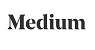

# customer-segmentation

Analyzing demographics data to identify potential customers within the general population

Medium Blog Post:

[](https://medium.com/@sameedakber.ai/customer-segmentation-report-for-arvato-financial-solutions-business-intelligence-from-36be5b71f480)

## Motivation

A mail-order company in Germany is looking into expanding their customer base. The best way to acquire new customers is by launching a targeted marketing campaign wherein specific individuals who are more likely to become customers are targeted with advertisements. The company requires identification of these 'potential customers' within the general population. Arvato Financial Solutions has tasked me with analyzing demographics data for both the mail-order company's customer base and the general population at large to identify parts of the population that best describe the core customer base of the company. The end goal of this project is to use data analysis from EDA and customer segmentation to build a model that predicts whether an individual in the general population is likely to become a customer.


## Installation

The following libraries will need to be installed and/or updated to run the code in Anaconda v4.6 running python v3.*.

```
pandas
scikit-learn
matplotlib
seaborn
plotly
imblearn
```

## File Descriptions

```
Arvato Customer Segmentation.ipynb - Notebook showcasing my work for the project
data/feature_info_2.xlsx - Excel file that maps feature names to data types and null placeholders
data/kaggle.csv - Entry for the kaggle competetion
data/azdias.csv - Demographics data for the general population
data/customers.csv - Demographics data for the mail-order compamy's customer base
data/mailout_train.csv - Demographics data for training classifier
data/mailout_test.csv - Demographics data for testing classifier

```

## Results

The main findings of this project are found in the medium blog [here](https://medium.com/@sameedakber.ai/customer-segmentation-report-for-arvato-financial-solutions-business-intelligence-from-36be5b71f480)


## Authors

* **Sameed Akber** - *customer-segmentation* - [sameedakber-ai](https://github.com/sameedakber-ai)

## License

Copyright 2019 Sameed Akber

Permission is hereby granted, free of charge, to any person obtaining a copy of this software and associated
documentation files (the "Software"), to deal in the Software without restriction, including without
limitation the rights to use, copy, modify, merge, publish, distribute, sublicense, and/or sell copies of
the Software, and to permit persons to whom the Software is furnished to do so, subject to the following
conditions:

The above copyright notice and this permission notice shall be included in all copies or substantial
portions of the Software.

THE SOFTWARE IS PROVIDED "AS IS", WITHOUT WARRANTY OF ANY KIND, EXPRESS OR IMPLIED, INCLUDING BUT NOT
LIMITED TO THE WARRANTIES OF MERCHANTABILITY, FITNESS FOR A PARTICULAR PURPOSE AND NONINFRINGEMENT. IN NO
EVENT SHALL THE AUTHORS OR COPYRIGHT HOLDERS BE LIABLE FOR ANY CLAIM, DAMAGES OR OTHER LIABILITY, WHETHER
IN AN ACTION OF CONTRACT, TORT OR OTHERWISE, ARISING FROM, OUT OF OR IN CONNECTION WITH THE SOFTWARE OR THE
USE OR OTHER DEALINGS IN THE SOFTWARE.

